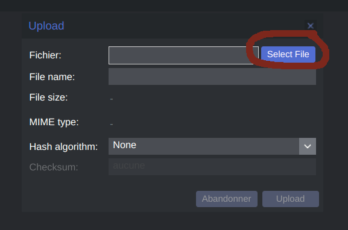
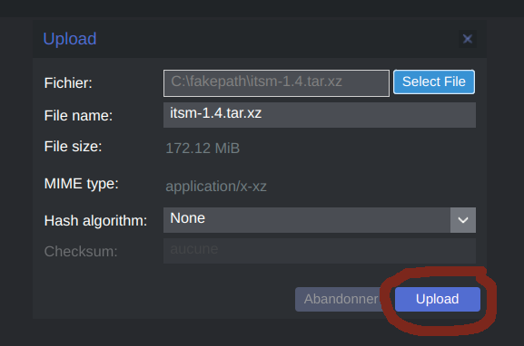

# Build LXC template

## Requirement
For building LXC template, we use distrobuilder. The installation guide is available [here](https://github.com/lxc/distrobuilder#installing-from-source).
## Build LXC Image
The command need to be launch with ROOT permission, you can launch this command with root user, or with sudo or doas software.

	$ git clone https://github.com/itsmng/itsm-lxc
	$ cd itsm-lxc
	$ distrobuilder build-lxc ubuntu.yaml
Now, your lxc is builded his name ***rootfs.tar.xz*** you can rename the image name with this command:
		
		$ mv rootfs.tar.xz ItsmNG-VERSION.tar.xz
## FAQ
### Change ITSM-NG version
you can change the ITSM-NG version in the template file, this file name ***ubuntu.yaml***
	
	$ vi ubuntu.yaml

	line 278: VERSION=1.4.0

### Install LXC template in Proxmox
* Select the LXC template storage

* Click on ***CT Modeles***

* Click on ***Upload***

* Click on ***Select*** and select the lxc template

* Click on ***Upload***

